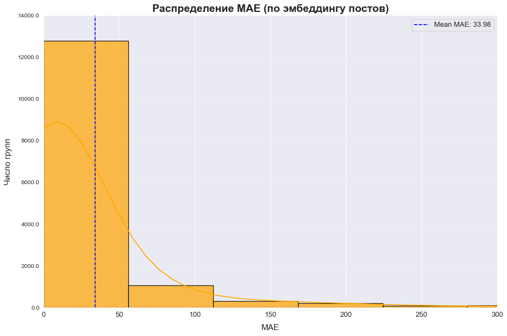
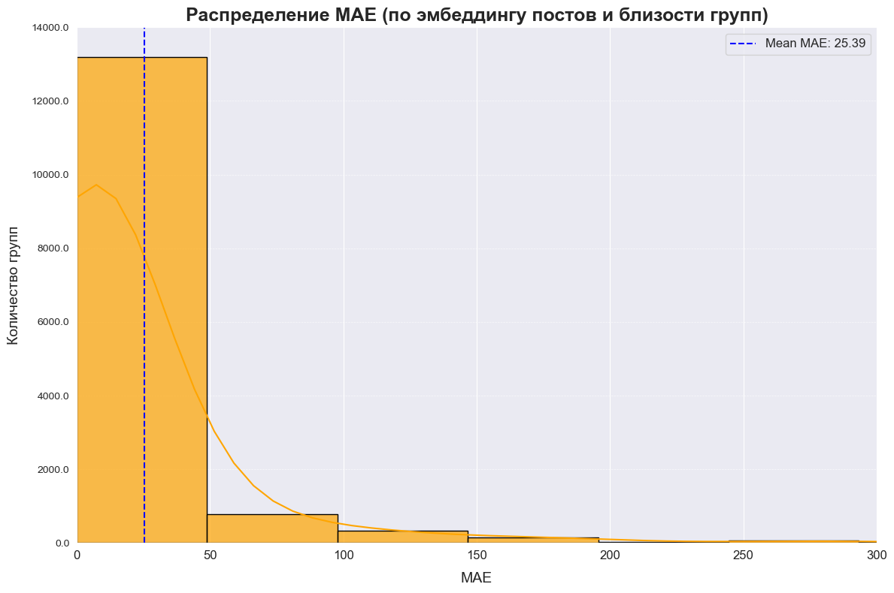
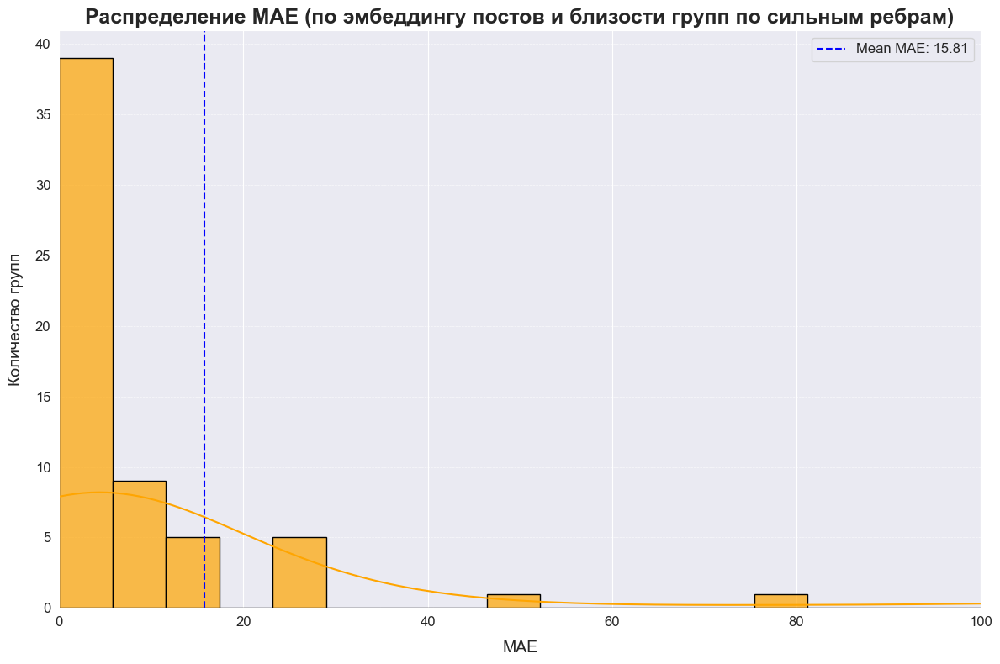

# Прогнозирование реакции пользователей на посты в социальных сообществах

## HSE social network analysis project

### Описание проекта
Проект посвящен прогнозированию реакции пользователей на посты в сообществах. На основе данных о взаимодействии с предыдущими публикациями в небольших группах, к которым они принадлежат, предлагается предсказывать отклики на новые посты. При этом учитываются не только отклики внутри самого сообщества, но и реакции в других сообществах, популярных среди подписчиков, что позволяет повысить точность прогнозов.

### Участники
- **Алябин Андрей**
- **Величко Екатерина**
- **Гранкина Елизавета**

## Методы и подходы

### Построение Жаккардовой матрицы
- **Многопоточный код на C++** использовался для расчета Жаккардовой матрицы, которая оценивает схожесть между сообществами на основе пересечения их участников.
- Матрица легла в основу графа, где:
  - **Вершины** — сообщества.
  - **Рёбра** — связи между сообществами, появляющиеся при схожести их участников.
  - **Вес рёбер** — коэффициент Жаккарда.

### Методы анализа
- **Random Forest Regressor** — основной алгоритм, показавший лучшие результаты.
- **Линейная регрессия** — тестировалась, но дала хуже результаты из-за неспособности учитывать нелинейные зависимости.

### Три модели:
1. **Baseline**: только эмбеддинги постов.
2. **Эмбеддинги постов + близость сообществ**: учитываются связи между сообществами через матрицу Жаккарда.
3. **Эмбеддинги постов + близость сообществ по сильным связям**: фокус на сильных рёбрах графа, что позволило улучшить прогнозы.

---

## Результаты

### MAE (Средняя абсолютная ошибка)
| Модель                                      | MAE   |
|---------------------------------------------|-------|
| Только эмбеддинг постов (baseline)          | 33.98 |
| Эмбеддинг постов + близость сообществ       | 25.39 |
| Эмбеддинг постов + сильные рёбра (взвешенная)| 15.81 |

### Гипотеза
Использование сетевой структуры взаимодействий между сообществами и эмбеддингов постов улучшило точность прогнозирования реакции пользователей на новые посты по сравнению с использованием только текстовых эмбеддингов.

### Визуализация результатов
Сравнение MAE для трёх моделей:

